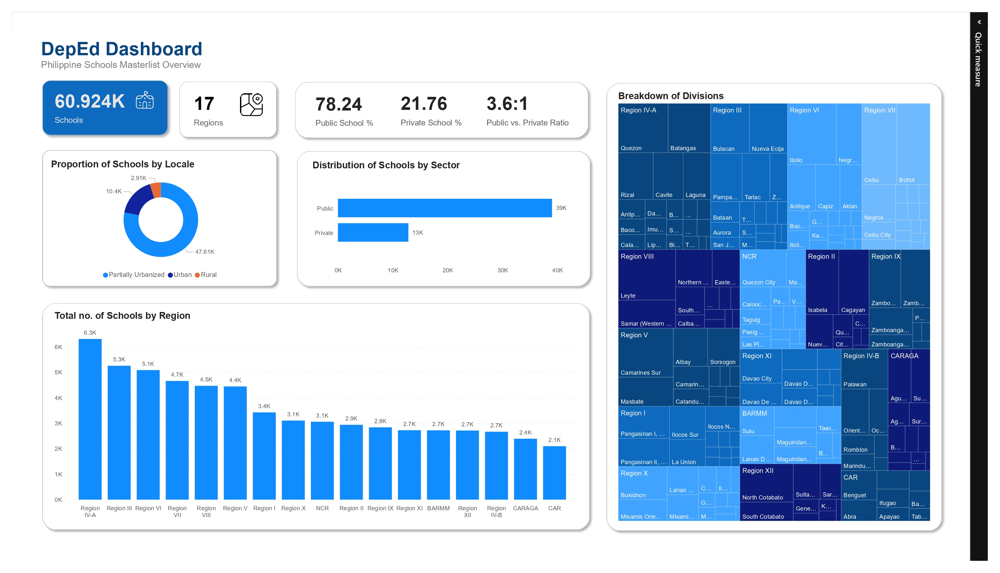

# SQL-Case-Study-on-DepEd-Schools-Masterlist

## <br>Overview

This project uses the S.Y. 2020-2021 DepEd Schools Masterlist that contains 64,000+ schools in the Philippines to demonstrate **SQL database creation**, **data cleaning**, and **analysis**.

## <br>Dataset
**Source:** [data.gov.ph](https://data.gov.ph/index/public/dataset/SY%202020-2021%20Masterlist%20of%20Schools/5dpij7nd-uhrj-wk5l-xv2h-q5pgkiccv9ag)
**<br>Shape:** 60,924 rows, 13 columns
**<br>Key Fields:** `region`, `division`, `municipality`, `sector`, `urban_rural_classification`, `school_subclassification`

## <br>Project Workflow
1. **Data Extraction and Preprocessing (Python)**
   - Extracted raw data from PDF using Python (pdfplumber).
   - Cleaned and standardized data using Pandas:
      - Corrected inconsistencies in municipality, sector, and classification fields.
      - Reformatted text cases and standardized identifiers.
   - Load cleaned dataset to PostgreSQL (`masterlist` table).
2. **Database Design** 
   - Used a denormalized table structure to simplify querying and improve performance for analysis.
   - Columns include:
`region`, `division`, `district`, `school_name`, `municipality`, `barangay`,
`sector`, `urban_rural_classification`, `school_subclassification`, and others.

3. **SQL Analysis**
   - Used SQL to query and analyze data.
   - Example analyses:
     - Top regions and divisions by number of schools.
     - Comparison between public vs. private schools.
     - Ratio for public and private schools per sector.
     - Classification of schools by sector and location.

4. **Data Visualization (Power BI)**
   - Created interactive dashboards to summarize and explore the DepEd Masterlist data.
   - Enhanced insights by using simple `DAX measures` for percentages and ratios.

## <br>Database Design
**Table name:** `masterlist` (denormalized)

| Field                                  | Description                             |
| --------------------------------------------- | --------------------------------------- |
| `region`                                      | Region where the school is located      |
| `division`                                    | Division under the region               |
| `district`                                    | District of the school                  |
| `municipality`                                | Municipality or city                    |
| `barangay`                                    | Barangay of the school                  |
| `beis_school_id`                              | Unique school ID                        |
| `school_name`                                 | Official school name                    |
| `street_address`                              | Street address                          |
| `legislative_district`                        | Legislative district                    |
| `sector`                                      | Public, Private, SUC/LUC                |
| `urban_rural_classification`                  | Urban, Rural, or Partially Urbanized                         |
| `school_subclassification`                    | DepEd Managed, Non-sectarian, Sectarian, etc. |
| `modified_curricular_offering_classification` | All Offering (K-12), ES and JHS (K-10), JHS with SHS, etc.           |


## <br>Key SQL Analyses

| Question                                  | Query Insight                             |
| --------------------------------------------- | --------------------------------------- |
| Regions by No. of Schools | - `Region IV-A` leads with 6300+ schools <br>- `CAR` had the fewest schools: only 2000+              |
| Public vs. Private Ratio | - `78.24%` public and `21.76%` private schools are there in the Philippines <br>- `1:2.7` that for every public school, there are ~3 private schools in NCR <br>- `15.02:1` that for every private school, there are ~15 public schools in Region-VIII
| Urban vs. Rural Schools | - `78.14%` in partially urbanized, `17.08%` in urban, and `4.78%` in rural areas <br>- In urban areas, `60.03%` of schools are private <br>- In partially urbanized and rural areas, `85.61%` and `94.47%` of schools are public, respectively
| Top Curricular Offering Classification | `71.84%` or `43700+` out of all schools are `Purely ES`
| Municipality with Zero Public School | Every `municipality` listed in the DepEd Masterlist has at least one public school
| Most School Classification per Region | - `62.67%` of schools are `non-sectarian` in NCR <br>- `78.07%` of schools are `DepED managed` in Region-VI

## <br>Data Visualization
The interactive DepEd Dashboard provides insights into school distribution across regions, sectors, and classifications.



## <br>Sample Queries
Below are the sample queries used in this project.
### a. SQL <hr>
**1. Public vs. Private Ratio per Sector**
```sql
SELECT
    urban_rural,
    SUM(CASE WHEN sector IN ('Public', 'SUCs/LUCs') THEN 1 ELSE 0 END) AS public_count,
    SUM(CASE WHEN sector = 'Private' THEN 1 ELSE 0 END) AS private_count,
    ROUND(SUM(CASE WHEN sector IN ('Public', 'SUCs/LUCs') THEN 1 ELSE 0 END)::numeric/SUM(COUNT(*)) OVER(PARTITION BY urban_rural) * 100,2) AS public_percentage,
    ROUND(SUM(CASE WHEN sector = 'Private' THEN 1 ELSE 0 END)::numeric/SUM(COUNT(*)) OVER(PARTITION BY urban_rural) * 100,2) AS private_percentage,
    CONCAT(ROUND(
            SUM(CASE WHEN sector IN ('Public', 'SUCs/LUCs') THEN 1 ELSE 0 END)::numeric/
            SUM(CASE WHEN sector = 'Private' THEN 1 ELSE 0 END), 2
        ), ' : 1') AS public_private_ratio
FROM masterlist
GROUP BY urban_rural;
```

**2. Most common school classification per region**
```sql
WITH rank_type AS (
    SELECT
        region,
        school_subclassification,
        COUNT(*) as total_count,
        ROUND(COUNT(*)/SUM(COUNT(*)) OVER(PARTITION BY region) * 100,2) AS percentage,
        RANK() OVER(PARTITION BY region ORDER BY COUNT(*) DESC)
    FROM masterlist
    GROUP BY region, school_subclassification
    ORDER BY region ASC, total_count DESC
)
SELECT 
    region,
    school_subclassification,
    percentage,
    total_count
FROM rank_type
WHERE rank = 1
ORDER BY region ASC;
```
**3. Total no. of schools in masterlist**
```sql
SELECT COUNT(*) AS total_count
FROM masterlist;
```

### b. DAX <hr>
**1. Public schools as percentage**
```DAX
Public School % = 
   ROUND(DIVIDE(
      CALCULATE(
         COUNTROWS(masterlist),
         masterlist[sector] = "Public"
      ),
      COUNTROWS(masterlist)
   ) * 100,2)
```

**2. Private schools as percentage**
```DAX
Private School % = 
ROUND(DIVIDE(
    CALCULATE(
        COUNTROWS(masterlist),
        masterlist[sector]="Private"
    ), 
    COUNTROWS(masterlist)
) * 100, 2)
```

**3. Public vs. Private ratio**
```DAX
Public vs. Private Ratio = 
VAR ratio = ROUND(
                DIVIDE([Public School %], 
                        [Private School %]
                ),2
            )

RETURN ratio & ":" & "1"
```

## <br>Tools and Technologies
   - **Python:** `pandas`, `pdfplumber`, `sqlalchemy`
   - **Database:** `PostgreSQL`
   - **BI tool**: `Power BI`
   - **Other tools:** `Excel`

## <br>Scope and Limitations

This analysis uses the **SY 2020–2021 DepEd Schools Masterlist**, which includes **all DepEd-registered schools operational during that school year**.  
- **Scope**: Public, private, SUC/LUC schools registered and active in 2020–2021  
- **Limitations**:  
  - Schools that closed **before** SY 2020–2021  
  - New schools that opened **after** SY 2020–2021  
  - Unregistered or informal learning centers

## <br>License

For educational and research purposes. Please credit DepEd Philippines when using in reports or projects.

<br><hr>
*built by [Ryannn06](https://github.com/Ryannn06)*